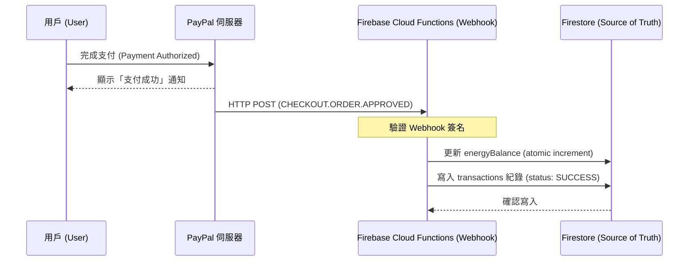

# PayPal 支付接入技術指南
**版本：** 1.0 (2026 Q1 - Production Ready)
**適用範圍：** Socratic AI Web Hub (`socratic.geledtech.com`)

---

## 🛠️ 1. 環境配置 (Environment Settings)

本系統支持 **Sandbox (測試)** 與 **Live (正式)** 雙環境切換。

### 憑證清單 (Credentials Table)

| 環境 | Client ID | Secret Key |
| :--- | :--- | :--- |
| **Sandbox** | `AYMGr_yLQJC1E9jG5XX...AtqEeP8` | `EGsYArOthVm4I38xZv...SxqTiWui` |
| **Live** | `AZR3aj5PFmyrGjENrd...EeGfoyK4` | `EHIl7xAoQ1hka4vSi8...k2jnPvmH` |

#### 詳細參數

**1. Sandbox (開發測試)**
- **Client ID**: `AYMGr_yLQJC1E9jG5XX8pR0X4GEDDsp7PfEFR6J4ZlJ1GFIRK4blB4RsRIgNg9NIb2eyYI1i1AtqEeP8`
- **Secret Key**: `EGsYArOthVm4I38xZvkOWkxUPc3pXooVTNKhmGGFK3q4sjvBAOzSpMRpxjqCfsW92CYG0fDzSxqTiWui`

**2. Live (正式營運)**
- **Client ID**: `AZR3aj5PFmyrGjENrdijDgklow6UMnfFnQ-jYyNJy8ekGWjODNfQpqCR6xRL-WFAJER1JB1ZEeGfoyK4`
- **Secret Key**: `EHIl7xAoQ1hka4vSi82EQcgJ7vOY5Zu3PkygTBAEbKRHU9F0ceyYXg1C2LPKxaSCClFQGoHXk2jnPvmH`

> [!CAUTION]
> **安全性警告**：目前生產環境已採用 **Live** 模式，所有交易將產生真實扣款。維護時請勿將 Secret Key 直接暴露在客戶端代碼中。

---

## 💻 2. 技術整合實作 (Technical Implementation)

### A. SDK 引入
在 `index.html` 的 `<head>` 中引入 PayPal 智能支付按鈕 SDK：
```html
<script src="https://www.paypal.com/sdk/js?client-id=您的_LIVE_CLIENT_ID&currency=USD"></script>
```

### B. 按鈕初始化邏輯
我們採用動態初始化函數 `initPayPalButton`，根據產品包（Starter, Advance, Scholar, Mega）傳入參數：
```javascript
function initPayPalButton(containerId, amount, zaps, packageName) {
    paypal.Buttons({
        createOrder: (data, actions) => {
            return actions.order.create({
                purchase_units: [{
                    description: packageName,
                    amount: { currency_code: "USD", value: amount }
                }]
            });
        },
        onApprove: (data, actions) => {
            return actions.order.capture().then(async (orderData) => {
                // 核心邏輯：支付成功後更新 Firebase
                await updateFirestoreEnergy(zaps, orderData);
            });
        }
    }).render(containerId);
}
```

---

## 🔄 3. 數據同步與履約 (Data Sync & Fulfillment)

支付成功後，系統透過 **Firestore 原子操作** 進行履約，確保數據一致性：

1.  **電力累加**：使用 `increment(zaps)` 進行原子加法，避免併發寫入衝突。
2.  **交易日誌**：使用 `arrayUnion` 將交易詳情（Order ID, Package, Amount, Date）寫入用戶的 `transactions` 數組。
3.  **實時通知**：由於 Extension 具備 `onSnapshot` 監聽，用戶支付完成的一瞬間，瀏覽器擴充功能中的電力數值會自動跳變。

---

## 🔒 4. 銀行級 Webhook 異步架構 (Bank-Grade Webhook Architecture)

為了徹底消除「掉單」風險並提升安全性，本系統建議採用 **Webhook 異步履約**。即使前端頁面被意外關閉，後端也會完成電力充值。

### 架構圖 (Flow Diagram)



### 實施細節 (Production Details)

- **Live Webhook ID**: `6P275978PC1122432`
- **Sandbox Webhook ID**: `1YA36551FW962153G`
- **Webhook URL**: `https://us-central1-socratic-ai-82849.cloudfunctions.net/paypalWebhookV2`
- **Status**: ✅ **ACTIVE / LIVE & SANDBOX**

### 架構圖 (Flow Diagram)

```javascript
// functions/index.js (Gen 2)
exports.paypalWebhookV2 = onRequest({ region: "us-central1" }, async (req, res) => {
    // 核心邏輯：接收 CHECKOUT.ORDER.APPROVED 並更新 Firestore
});
```

> [!IMPORTANT]
> **安全提醒**：目前的 V2 版本已上線並穩定運行。若日後需要針對 Webhook ID 進行簽名驗證 (Webhook Signature Verification)，請參考 PayPal 官方文件引入 `paypal-rest-sdk`。

---

## 🛠️ 5. 維護與故障排除 (Maintenance & FAQ)

### 如何切換回 Sandbox 測試環境？
1.  將 SDK URL 的 `client-id` 替換為 Sandbox ID。
2.  在 Firebase 測試帳號中手動測試 `onApprove` 回調。

### 交易成功但電力沒增加？
1.  檢查 Firebase Auth 狀態：用戶必須在登入狀態下才能完成資料寫入。
2.  檢查 Firestore Security Rules：確認 `/users/{uid}` 權限是否允許更新操作。
3.  檢查 Console Log：查看是否有 `capture()` 之後的 Firebase 寫入錯誤。

---
*本文檔由技術管理團隊維護，最後更新時間：2026/02/02。*
